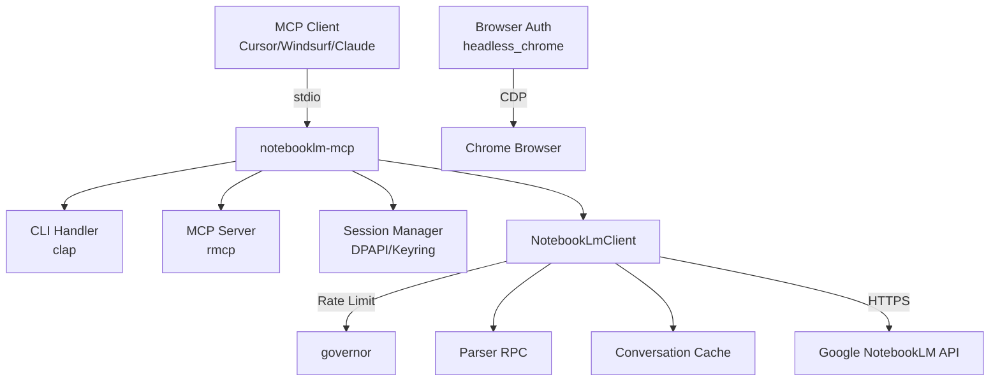

<div align="center">

# NotebookLM MCP Server

> Un servidor MCP no oficial que permite a agentes IA interacting con libretas Google NotebookLM — crear libretas, añadir fuentes, y chatear con documentos.

<br/>


<br/>

[**Quick Start**](#quick-start) · [**Documentation**](#documentation) · [**Architecture**](#architecture-at-a-glance) · [**Roadmap**](#roadmap)

</div>

---

## What this is

NotebookLM MCP Server es un servidor MCP (Model Context Protocol) no oficial que actúa como bridge entre agentes IA y Google NotebookLM. Permite crear libretas, añadir fuentes de texto, y hacer preguntas al chatbot de IA — todo desde cualquier cliente MCP compatible.

El proyecto hace **reverse engineering** de las APIs internas de Google, ya que NotebookLM no tiene API oficial. Está diseñado para integrarse con herramientas como Cursor, Windsurf, Claude Desktop, y cualquier cliente que soporte el protocolo MCP.

## Why this exists

Google NotebookLM es una herramienta poderosa para resumir documentos y chatear con ellos, pero no existe una API pública. Este proyecto surge para cerrar esa brecha, permitiendo automatización e integración con agentes IA que necesitan interacting con libretas NotebookLM.

Antes существовала la opción de usar notebooklm-py (Python), pero no había una implementación nativa en Rust que fuera rápida y fácil de integrar con servers MCP modernos.

---

## Key features

- 🔌 **Servidor MCP completo** — 4 tools: `notebook_list`, `notebook_create`, `source_add`, `ask_question`
- 🌐 **Recursos MCP** — Notebooks disponibles como `notebook://{uuid}` URIs
- 🔐 **Autenticación browser automation** — Extrae cookies HttpOnly via Chrome headless (CDP)
- 🔑 **Múltiples métodos de auth** — DPAPI (Windows), Keyring, Chrome headless
- ⚡ **Rate limiting integrado** — 2 req/segundo para proteger la API de Google
- 💾 **Cache conversacional** — Mantiene contexto entre preguntas
- 🔄 **Polling automático** — Espera indexación de fuentes antes de permitir preguntas
- 🛡️ **Errores estructurados** — Mejor debugging y manejo de errores

---

## Quick Start

```bash
# 1. Clone
git clone https://github.com/maisonnat/notebooklm-rust-mcp && cd notebooklm-rust-mcp

# 2. Build
cargo build --release

# 3. Authenticate (recommended - opens Chrome)
./target/release/notebooklm-mcp auth-browser

# 4. Verify connection
./target/release/notebooklm-mcp verify
```

> Full setup guide → [docs/04-setup.md](./docs/04-setup.md)

---

## Architecture at a glance



El servidor recibe requests via stdio del cliente MCP, los procesa usando el cliente HTTP interno, y se comunica con las APIs de NotebookLM. Incluye rate limiting, parsing defensivo de respuestas RPC, y cache conversacional.

→ [Full architecture docs](./docs/01-architecture.md)

---

## Documentation

| Document | Description | Audience |
|---|---|---|
| [Overview](./docs/00-overview.md) | Project identity, purpose, tech stack | Everyone |
| [Architecture](./docs/01-architecture.md) | System design, modules, patterns, history | Engineers |
| [API Reference](./docs/02-api-reference.md) | Endpoints, commands, configuration | Engineers |
| [Data Models](./docs/03-data-models.md) | Entities, schemas, relationships | Engineers |
| [Setup Guide](./docs/04-setup.md) | Installation, configuration, dev workflow | Everyone |
| [User Guide](./docs/05-user-guide.md) | Use cases, expected behavior | Users |
| [Changelog](./docs/06-changelog.md) | History, releases, migrations | Everyone |

> 💡 New here? Start with the [Overview](./docs/00-overview.md).
> Building on top of this? Go to [API Reference](./docs/02-api-reference.md).
> Something broke? See [Setup — Troubleshooting](./docs/04-setup.md#troubleshooting).

---

## Roadmap

### Done ✅
- MCP Server implementation with 4 tools
- Browser-based authentication (headless Chrome)
- Rate limiting with exponential backoff
- Conversation cache for context
- Source polling for indexation

### In progress 🚧
- Improving streaming response parsing
- Adding more test coverage
- Linux/macOS credential storage support

### Planned 📋
- Add support for audio source upload
- Improve error recovery mechanisms
- Add more robust session refresh
- Consider WebSocket for real-time streaming

> Have an idea? [Open an issue](https://github.com/maisonnat/notebooklm-rust-mcp/issues) or see [Contributing](#contributing).

---

## Contributing

Contributions are welcome. Before opening a PR:

1. Check open issues for existing discussions
2. Run `cargo test` — all tests must pass
3. Follow the existing code style in `src/`

For major changes, open an issue first to discuss the approach.

---

## License

MIT — see [LICENSE](./LICENSE) for details.
