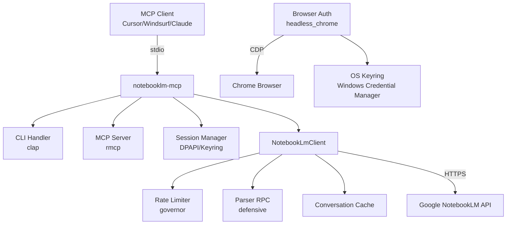
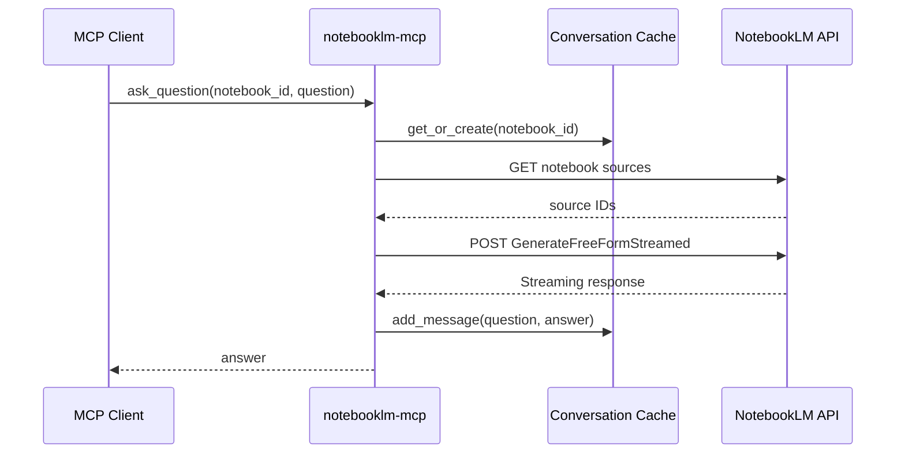

# Architecture — NotebookLM MCP Server

## System overview

El servidor MCP recibe requests de clientes MCP via stdio, los procesa usando un cliente HTTP interno con rate limiting, y se comunica con las APIs internas de NotebookLM. Usa un parser defensivo para manejar las respuestas RPC de Google.

## Project type

**CLI tool + MCP Server** — Aplicación standalone que funciona tanto como herramienta CLI como servidor MCP. Opera como bridge entre agentes IA y las APIs internas de NotebookLM.

## Module breakdown

| Module | Responsibility | Key files |
|--------|---------------|-----------|
| `main.rs` | Entry point, CLI parsing, MCP server, session management | `src/main.rs` |
| `notebooklm_client.rs` | HTTP client, rate limiting, retry, conversation cache | `src/notebooklm_client.rs` |
| `auth_browser.rs` | Browser automation, cookie extraction, keyring storage | `src/auth_browser.rs` |
| `auth_helper.rs` | CSRF extraction, session validation | `src/auth_helper.rs` |
| `parser.rs` | Defensive RPC parsing, anti-XSSI cleaning | `src/parser.rs` |
| `source_poller.rs` | Source indexation polling | `src/source_poller.rs` |
| `conversation_cache.rs` | Per-notebook conversation history | `src/conversation_cache.rs` |
| `errors.rs` | Structured error types | `src/errors.rs` |

## Entry points

| Entry point | Purpose |
|-------------|---------|
| `cargo run` or binary | Inicia el servidor MCP via stdio |
| `notebooklm-mcp auth-browser` | Autenticación browser automation |
| `notebooklm-mcp auth --cookie --csrf` | Autenticación manual |
| `notebooklm-mcp verify` | Verifica conexión con NotebookLM |

## Design patterns

### Defensive parsing

**Where:** `src/parser.rs`
**How:** Every accessor function (`get_string_at`, `get_uuid_at`, etc.) returns `Option<T>` instead of using unwrap(). All array accesses are bounds-checked.
**Why:** Google's RPC responses are complex nested arrays with inconsistent structures. Defensive parsing prevents crashes when unexpected data appears.

### Rate limiting with jitter

**Where:** `src/notebooklm_client.rs`
**How:** Uses `governor` crate with 2 req/sec quota. Adds random jitter (100-1000ms) between requests.
**Why:** Google's API has strict rate limits. Jitter prevents thundering herd when many clients retry after a rate limit.

### Conversation caching

**Where:** `src/conversation_cache.rs`
**How:** Stores (notebook_id, conversation_id, history) in a RwLock-protected HashMap.
**Why:** NotebookLM's streaming API requires a conversation ID that persists across questions. The cache ensures the same conversation ID is reused.

## Key architectural decisions

| Decision | Rationale | Trade-off |
|----------|-----------|-----------|
| MCP via rmcp | Protocolo estándar para agentes IA | Añade dependencia de rmcp |
| Chrome headless para auth | Extrae HttpOnly cookies que no se pueden copiar manualmente | Requiere Chrome instalado |
| DPAPI para Windows | Encriptación nativa sin dependencias externas | Solo funciona en Windows |
| Rate limiting 2 req/s | Protege cuenta de Google de bans | Throughput limitado |
| Parser defensivo | Las APIs de Google cambian frecuentemente | Más código que parsing simple |

> [!NOTE] 🧑‍💻 For engineers
> La decisión de usar Chrome headless fue tomada porque las cookies `__Secure-1PSID` tienen el flag HttpOnly y no pueden accederse desde JavaScript.

## Data flow

El flujo típico de una pregunta al chatbot:

## External integrations

| Service | Purpose | How connected |
|---------|---------|--------------|
| Google NotebookLM API | Core functionality | HTTP batchexecute + streaming |
| Chrome (CDP) | Browser automation | headless_chrome crate |
| Windows Credential Manager | Secure credential storage | keyring crate |
| Windows DPAPI | Fallback encryption | windows-dpapi crate |

> [!NOTE]
> See [[02-api-reference]] for the public interface surface.
> See [[03-data-models]] for entity relationships.

---

## Architectural history

### Period 1: Initial implementation (2026-04-03)

El proyecto nació como una implementación en Rust del proyecto Python `notebooklm-py`. El foco inicial fue:
- Implementar el servidor MCP básico con rmcp
- Descubrir los RPC IDs de la API (wXbhsf, CCqFvf, izAoDd, rLM1Ne)
- Implementar autenticación manual con DPAPI

### Period 2: Browser automation (2026-04-04)

Se añadió autenticación via Chrome headless para:
- Eliminar la necesidad de copiar cookies manualmente
- Extraer cookies HttpOnly que no se pueden ver en DevTools
- Proveer una experiencia de usuario más fluida

### Current state

El servidor está operativo con 4 tools MCP funcionando. Los próximos desafíos incluyen:
- Mejorar el parsing de respuestas streaming
- Añadir soporte para Linux/macOS en credential storage
- Mejorar manejo de errores y recovery
