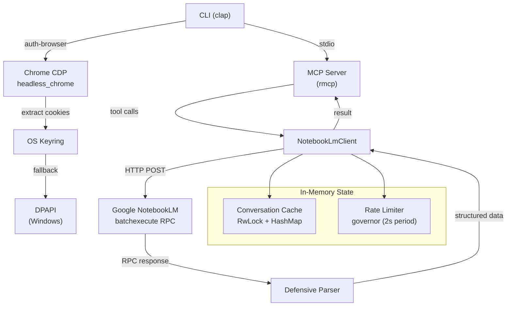
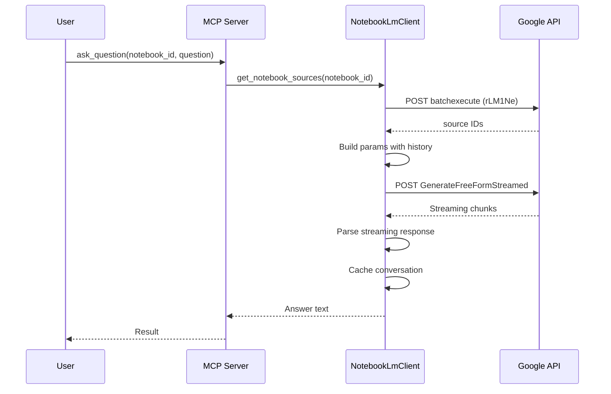

# Architecture

## System Overview



## Module Structure

```
src/
├── main.rs                # CLI entrypoint + MCP server definition + DPAPI session
├── notebooklm_client.rs   # HTTP client for NotebookLM RPC API
├── parser.rs              # Defensive parser for Google RPC responses
├── errors.rs              # Structured error enum
├── auth_browser.rs        # Chrome CDP automation + keyring storage
├── auth_helper.rs         # CSRF token extraction from HTML
├── conversation_cache.rs  # In-memory conversation history per notebook
└── source_poller.rs       # Async polling for source readiness
```

## Module Responsibilities

### `main.rs` — Entry Point
- CLI command parsing via `clap` (auth, auth-browser, verify, ask, add-source)
- MCP server definition using `rmcp` macros (`#[tool_router]`, `#[tool_handler]`)
- MCP resource listing (`notebook://` URIs)
- Session management with DPAPI encryption (Windows fallback)

### `notebooklm_client.rs` — HTTP Client
- All RPC communication with Google's batchexecute endpoint
- Rate limiting via `governor` (2-second quota period = ~30 req/min)
- Exponential backoff with jitter for retries (max 3 retries, 30s cap)
- Streaming response parsing for `ask_question`
- Upload semaphore (max 2 concurrent uploads)

### `parser.rs` — Defensive Parser
- Strips Google's anti-XSSI prefix (`)]}'`)
- Extracts RPC responses by `rpc_id` from positional arrays
- Safe array access (never `unwrap` on indices)
- UUID validation (36-character strings)

### `errors.rs` — Structured Errors
- `SessionExpired` — cookie expired, user must re-auth
- `CsrfExpired` — CSRF token invalid, attempt auto-refresh
- `SourceNotReady` — source still indexing, poll again
- `RateLimited` — too many requests, back off
- `ParseError` — malformed response from Google
- `NetworkError` — connection/timeout failure
- Auto-detection from HTTP status codes via `from_string()`

### `auth_browser.rs` — Browser Authentication
- Launches Chrome via CDP for Google login
- Extracts `__Secure-1PSID` and `__Secure-1PSIDTS` cookies
- Stores credentials in OS keyring (primary)
- Falls back to DPAPI encrypted file (Windows)

### `auth_helper.rs` — CSRF Management
- Extracts `SNlM0e` CSRF token from NotebookLM HTML via regex
- Validates session cookies (checks for 401/403/redirect)
- 10-second timeout for HTTP requests

### `conversation_cache.rs` — Conversation History
- `Arc<ConversationCache>` shared across the client
- `RwLock<HashMap>` for concurrent read/write access
- Reuses `conversation_id` per notebook (no new UUID per question)

### `source_poller.rs` — Source Readiness
- Polls every 2 seconds (configurable) until source is indexed
- 60-second timeout with 30 max retries (configurable)
- `SourceState` enum: Ready | Processing | Error | Unknown

## Design Patterns

| Pattern | Where | Why |
|---------|-------|-----|
| `Arc<RwLock<T>>` | Client state, conversation cache | Shared mutable state across async tasks |
| Rate limiter (token bucket) | `governor::RateLimiter` | Prevent Google API abuse |
| Exponential backoff + jitter | `batchexecute_with_retry` | Avoid thundering herd on errors |
| Defensive parsing | `parser.rs` | Google API returns fragile positional arrays |
| Keyring-first + fallback | `auth_browser.rs` | Cross-platform credential storage |
| Builder pattern | `rmcp::ServerCapabilities` | MCP server configuration |

## Data Flow



## RPC Endpoints Used

| RPC ID | Operation | Endpoint |
|--------|-----------|----------|
| `wXbhsf` | List notebooks | batchexecute |
| `CCqFvf` | Create notebook | batchexecute |
| `izAoDd` | Add source | batchexecute |
| `rLM1Ne` | Get notebook sources | batchexecute |
| `GenerateFreeFormStreamed` | Ask question | Streaming endpoint |
