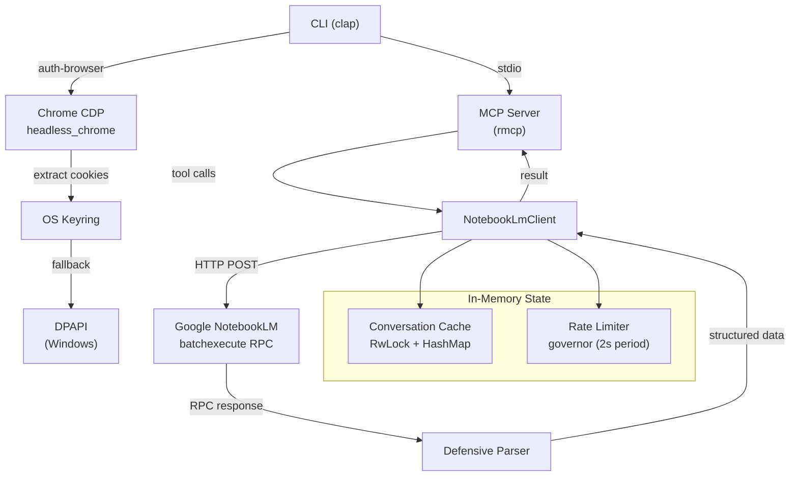
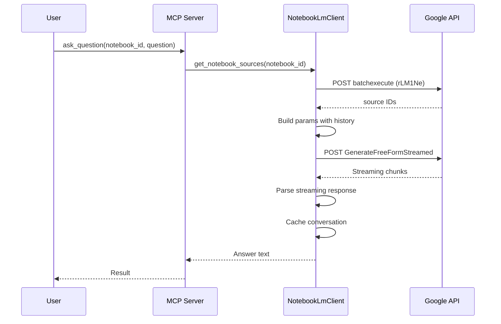

# Arquitectura

## Vista General del Sistema



## Estructura de Modulos

```
src/
├── main.rs                # Punto de entrada CLI + definicion del servidor MCP + sesion DPAPI
├── notebooklm_client.rs   # Cliente HTTP para la API RPC de NotebookLM
├── parser.rs              # Parser defensivo para respuestas RPC de Google
├── errors.rs              # Enum de errores estructurados
├── auth_browser.rs        # Automatizacion Chrome CDP + almacenamiento en keyring
├── auth_helper.rs         # Extraccion de token CSRF desde HTML
├── conversation_cache.rs  # Historial de conversacion en memoria por notebook
└── source_poller.rs       # Sondeo asincrono para disponibilidad de fuentes
```

## Responsabilidades de los Modulos

### `main.rs` — Punto de Entrada
- Parseo de comandos CLI via `clap` (auth, auth-browser, verify, ask, add-source)
- Definicion del servidor MCP usando macros de `rmcp` (`#[tool_router]`, `#[tool_handler]`)
- Listado de recursos MCP (URIs `notebook://`)
- Gestion de sesion con encriptacion DPAPI (fallback en Windows)

### `notebooklm_client.rs` — Cliente HTTP
- Toda la comunicacion RPC con el endpoint batchexecute de Google
- Limitacion de tasa via `governor` (periodo de cuota de 2 segundos = ~30 req/min)
- Backoff exponencial con jitter para reintentos (maximo 3 reintentos, techo de 30s)
- Parseo de respuestas en streaming para `ask_question`
- Semaforo de subida (maximo 2 subidas concurrentes)

### `parser.rs` — Parser Defensivo
- Remueve el prefijo anti-XSSI de Google (`)]}'`)
- Extrae respuestas RPC por `rpc_id` desde arreglos posicionales
- Acceso seguro a arreglos (nunca usa `unwrap` en indices)
- Validacion de UUIDs (cadenas de 36 caracteres)

### `errors.rs` — Errores Estructurados
- `SessionExpired` — cookie expirada, el usuario debe re-autenticarse
- `CsrfExpired` — token CSRF invalido, intenta auto-refrescar
- `SourceNotReady` — fuente todavia indexando, sondear de nuevo
- `RateLimited` — demasiadas solicitudes, retroceder
- `ParseError` — respuesta malformada de Google
- `NetworkError` — fallo de conexion/timeout
- Auto-deteccion desde codigos de estado HTTP via `from_string()`

### `auth_browser.rs` — Autenticacion via Browser
- Lanza Chrome via CDP para login de Google
- Extrae las cookies `__Secure-1PSID` y `__Secure-1PSIDTS`
- Almacena credenciales en el keyring del SO (primario)
- Recurre a archivo encriptado con DPAPI (Windows)

### `auth_helper.rs` — Gestion de CSRF
- Extrae el token CSRF `SNlM0e` desde el HTML de NotebookLM via regex
- Valida cookies de sesion (verifica 401/403/redirect)
- Timeout de 10 segundos para solicitudes HTTP

### `conversation_cache.rs` — Historial de Conversacion
- `Arc<ConversationCache>` compartido en todo el cliente
- `RwLock<HashMap>` para acceso concurrente de lectura/escritura
- Reutiliza el `conversation_id` por notebook (no genera un nuevo UUID por pregunta)

### `source_poller.rs` — Disponibilidad de Fuentes
- Sondea cada 2 segundos (configurable) hasta que la fuente este indexada
- Timeout de 60 segundos con 30 reintentos maximos (configurable)
- Enum `SourceState`: Ready | Processing | Error | Unknown

## Patrones de Diseno

| Patron | Donde | Por que |
|--------|-------|---------|
| `Arc<RwLock<T>>` | Estado del cliente, cache de conversaciones | Estado mutable compartido entre tareas async |
| Rate limiter (token bucket) | `governor::RateLimiter` | Previene abuso de la API de Google |
| Backoff exponencial + jitter | `batchexecute_with_retry` | Evita efecto thundering herd en errores |
| Parseo defensivo | `parser.rs` | La API de Google devuelve arreglos posicionales fragiles |
| Keyring primero + fallback | `auth_browser.rs` | Almacenamiento de credenciales multiplataforma |
| Builder pattern | `rmcp::ServerCapabilities` | Configuracion del servidor MCP |

## Flujo de Datos



## Endpoints RPC Utilizados

| ID RPC | Operacion | Endpoint |
|--------|-----------|----------|
| `wXbhsf` | Listar notebooks | batchexecute |
| `CCqFvf` | Crear notebook | batchexecute |
| `izAoDd` | Agregar fuente | batchexecute |
| `rLM1Ne` | Obtener fuentes del notebook | batchexecute |
| `GenerateFreeFormStreamed` | Hacer pregunta | Streaming endpoint |
