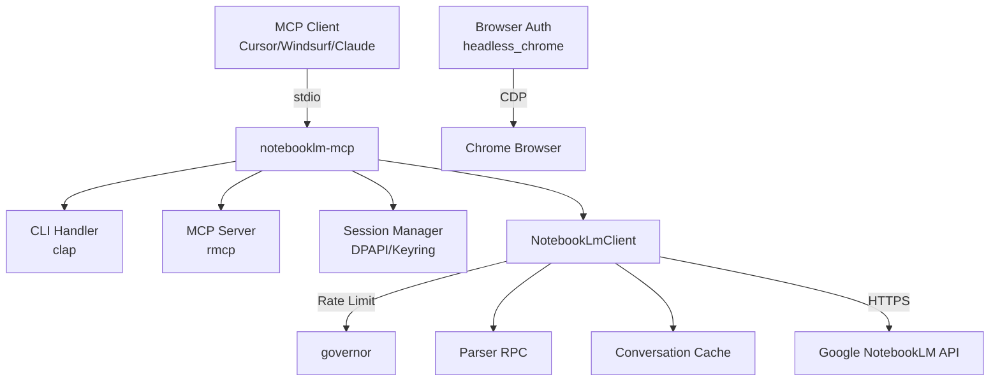

<div align="center">

# NotebookLM MCP Server

> Un servidor MCP no oficial que permite a agentes IA interacting con libretas Google NotebookLM — crear libretas, añadir fuentes, y chatear con documentos.

<br/>


<br/>

[**Quick Start**](#quick-start) · [**Documentation**](#documentation) · [**Architecture**](#architecture-at-a-glance) · [**Roadmap**](#roadmap)

</div>

---

## What this is (Español)

NotebookLM MCP Server es un servidor MCP (Model Context Protocol) no oficial que actúa como puente entre agentes IA y Google NotebookLM. Permite crear libretas, añadir fuentes de texto, y hacer preguntas al chatbot de IA — todo desde cualquier cliente MCP compatible.

El proyecto hace **ingeniería inversa** de las APIs internas de Google, ya que NotebookLM no tiene API oficial. Está diseñado para integrarse con herramientas como Cursor, Windsurf, Claude Desktop, y cualquier cliente que soporte el protocolo MCP.

## Why this exists (Español)

Google NotebookLM es una herramienta poderosa para resumir documentos y chatear con ellos, pero no existe una API pública. Este proyecto surge para cerrar esa brecha, permitiendo automatización e integración con agentes IA que necesitan interacting con libretas NotebookLM.

Antes existía la opción de usar notebooklm-py (Python), pero no había una implementación nativa en Rust que fuera rápida y fácil de integrar con servidores MCP modernos.

---

## Key features (Español)

- 🔌 **Servidor MCP completo** — 4 tools: `notebook_list`, `notebook_create`, `source_add`, `ask_question`
- 🌐 **Recursos MCP** — Notebooks disponibles como `notebook://{uuid}` URIs
- 🔐 **Autenticación browser automation** — Extrae cookies HttpOnly via Chrome headless (CDP)
- 🔑 **Múltiples métodos de auth** — DPAPI (Windows), Keyring, Chrome headless
- ⚡ **Rate limiting integrado** — 2 req/segundo para proteger la API de Google
- 💾 **Cache conversacional** — Mantiene contexto entre preguntas
- 🔄 **Polling automático** — Espera indexación de fuentes antes de permitir preguntas
- 🛡️ **Errores estructurados** — Mejor depuración y manejo de errores

---

## Quick Start (Español)

```bash
# 1. Clonar
git clone https://github.com/maisonnat/notebooklm-rust-mcp && cd notebooklm-rust-mcp

# 2. Compilar
cargo build --release

# 3. Autenticarse (recomendado - abre Chrome)
./target/release/notebooklm-mcp auth-browser

# 4. Verificar conexión
./target/release/notebooklm-mcp verify
```

> Guía de configuración completa → [docs/es/04-setup.md](./docs/es/04-setup.md)

---

## Architecture at a glance (Español)



El servidor recibe requests via stdio del cliente MCP, los procesa usando el cliente HTTP interno, y se comunica con las APIs de NotebookLM. Incluye rate limiting, parsing defensivo de respuestas RPC, y cache conversacional.

→ [Documentación de arquitectura completa](./docs/es/01-architecture.md)

---

## Documentation (Español)

| Document | Description | Audience |
|---|---|---|
| [Overview](./docs/es/00-overview.md) | Project identity, purpose, tech stack | Everyone |
| [Architecture](./docs/es/01-architecture.md) | System design, modules, patterns, history | Engineers |
| [API Reference](./docs/es/02-api-reference.md) | Endpoints, commands, configuration | Engineers |
| [Data Models](./docs/es/03-data-models.md) | Entities, schemas, relationships | Engineers |
| [Setup Guide](./docs/es/04-setup.md) | Installation, configuration, dev workflow | Everyone |
| [User Guide](./docs/es/05-user-guide.md) | Use cases, expected behavior | Users |
| [Changelog](./docs/es/06-changelog.md) | History, releases, migrations | Everyone |

> 💡 ¿Nuevo aquí? Empezá con el [Overview](./docs/es/00-overview.md).
> ¿Building on top of this? Ir a [API Reference](./docs/es/02-api-reference.md).
> ¿Something broke? Ver [Setup — Troubleshooting](./docs/es/04-setup.md#troubleshooting).

---

## Roadmap (Español)

### Done ✅
- Implementación de servidor MCP con 4 tools
- Autenticación basada en navegador (headless Chrome)
- Rate limiting con exponential backoff
- Cache de conversación para contexto
- Source polling para indexación

### In progress 🚧
- Mejorar parsing de respuestas streaming
- Añadir más cobertura de tests
- Soporte Linux/macOS para credential storage

### Planned 📋
- Añadir soporte para upload de fuentes de audio
- Mejorar mecanismos de recovery de errores
- Añadir refresh de sesión más robusto
- Considerar WebSocket para streaming en tiempo real

> ¿Tenés una idea? [Abrir un issue](https://github.com/maisonnat/notebooklm-rust-mcp/issues) o ver [Contributing](#contributing).

---

## Contributing (Español)

Las contribuciones son bienvenidas. Antes de abrir un PR:

1. Buscar en issues abiertos para discusiones existentes
2. Ejecutar `cargo test` — todos los tests deben pasar
3. Seguir el estilo de código existente en `src/`

Para cambios importantes, primero abrir un issue para discutir el approach.

---

## License (Español)

MIT — ver [LICENSE](./LICENSE) para detalles.
