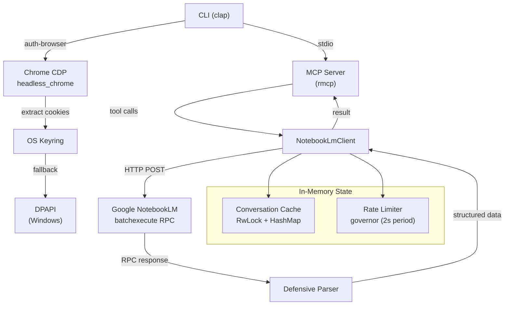
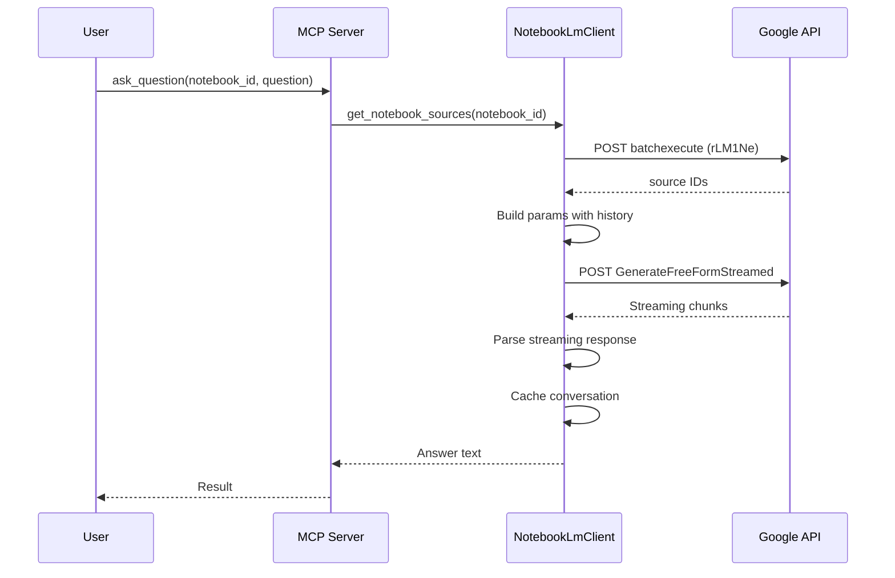

# Arquitetura

## Visao Geral do Sistema



## Estrutura de Modulos

```
src/
├── main.rs                # CLI entrypoint + MCP server definition + DPAPI session
├── notebooklm_client.rs   # HTTP client for NotebookLM RPC API
├── parser.rs              # Defensive parser for Google RPC responses
├── errors.rs              # Structured error enum
├── auth_browser.rs        # Chrome CDP automation + keyring storage
├── auth_helper.rs         # CSRF token extraction from HTML
├── conversation_cache.rs  # In-memory conversation history per notebook
└── source_poller.rs       # Async polling for source readiness
```

## Responsabilidades dos Modulos

### `main.rs` — Ponto de Entrada
- Parsing de comandos CLI via `clap` (auth, auth-browser, verify, ask, add-source)
- Definicao do servidor MCP usando macros `rmcp` (`#[tool_router]`, `#[tool_handler]`)
- Listagem de recursos MCP (URIs `notebook://`)
- Gerenciamento de sessao com criptografia DPAPI (fallback Windows)

### `notebooklm_client.rs` — Cliente HTTP
- Toda comunicacao RPC com o endpoint batchexecute do Google
- Limitacao de taxa via `governor` (periodo de quota de 2 segundos = ~30 req/min)
- Backoff exponencial com jitter para retentativas (maximo 3 tentativas, teto de 30s)
- Parsing de resposta streaming para `ask_question`
- Semaforo de upload (maximo 2 uploads simultaneos)

### `parser.rs` — Parser Defensivo
- Remove o prefixo anti-XSSI do Google (`)]}'`)
- Extrai respostas RPC por `rpc_id` de arrays posicionais
- Acesso seguro a arrays (nunca `unwrap` em indices)
- Validacao de UUID (strings de 36 caracteres)

### `errors.rs` — Erros Estruturados
- `SessionExpired` — cookie expirado, usuario deve reautenticar
- `CsrfExpired` — token CSRF invalido, tenta atualizacao automatica
- `SourceNotReady` — fonte ainda indexando, faca polling novamente
- `RateLimited` — excesso de requisicoes, reduza o ritmo
- `ParseError` — resposta malformada do Google
- `NetworkError` — falha de conexao/timeout
- Deteccao automatica a partir de codigos de status HTTP via `from_string()`

### `auth_browser.rs` — Autenticacao via Browser
- Inicia o Chrome via CDP para login no Google
- Extrai os cookies `__Secure-1PSID` e `__Secure-1PSIDTS`
- Armazena credenciais no keyring do SO (primario)
- Fallback para arquivo criptografado com DPAPI (Windows)

### `auth_helper.rs` — Gerenciamento de CSRF
- Extrai o token CSRF `SNlM0e` do HTML do NotebookLM via regex
- Valida cookies de sessao (verifica 401/403/redirect)
- Timeout de 10 segundos para requisicoes HTTP

### `conversation_cache.rs` — Historico de Conversa
- `Arc<ConversationCache>` compartilhado pelo cliente
- `RwLock<HashMap>` para acesso concorrente de leitura/escrita
- Reutiliza o `conversation_id` por caderno (nenhum UUID novo por pergunta)

### `source_poller.rs` — Prontidao de Fontes
- Faz polling a cada 2 segundos (configuravel) ate que a fonte seja indexada
- Timeout de 60 segundos com maximo de 30 retentativas (configuravel)
- Enum `SourceState`: Ready | Processing | Error | Unknown

## Padroes de Projeto

| Padrao | Onde | Por que |
|--------|------|---------|
| `Arc<RwLock<T>>` | Estado do cliente, cache de conversa | Estado mutavel compartilhado entre tasks assincronas |
| Rate limiter (token bucket) | `governor::RateLimiter` | Previne abuso da API do Google |
| Backoff exponencial + jitter | `batchexecute_with_retry` | Evita efeito de enxame em erros |
| Parsing defensivo | `parser.rs` | A API do Google retorna arrays posicionais frageis |
| Keyring-first + fallback | `auth_browser.rs` | Armazenamento de credenciais multiplataforma |
| Padrao Builder | `rmcp::ServerCapabilities` | Configuracao do servidor MCP |

## Fluxo de Dados



## Endpoints RPC Utilizados

| RPC ID | Operacao | Endpoint |
|--------|----------|----------|
| `wXbhsf` | Listar cadernos | batchexecute |
| `CCqFvf` | Criar caderno | batchexecute |
| `izAoDd` | Adicionar fonte | batchexecute |
| `rLM1Ne` | Obter fontes do caderno | batchexecute |
| `GenerateFreeFormStreamed` | Fazer pergunta | Endpoint de streaming |
