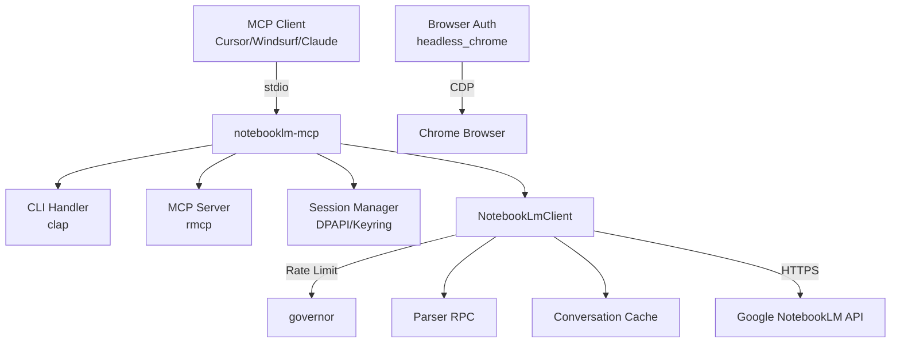

<div align="center">

# NotebookLM MCP Server

> Um servidor MCP não oficial que permite a agentes IA interagir com cadernos do Google NotebookLM — criar cadernos, adicionar fontes e conversar com documentos.

<br/>


<br/>

[**Quick Start**](#quick-start) · [**Documentation**](#documentation) · [**Architecture**](#architecture-at-a-glance) · [**Roadmap**](#roadmap)

</div>

---

## O que é (Português)

NotebookLM MCP Server é um servidor MCP (Model Context Protocol) não oficial que atua como ponte entre agentes IA e Google NotebookLM. Permite criar cadernos, adicionar fontes de texto e fazer perguntas ao chatbot de IA — tudo de qualquer cliente MCP compatível.

O projeto faz **engenharia reversa** das APIs internas do Google, já que o NotebookLM não tem API oficial. Foi projetado para se integrar com ferramentas como Cursor, Windsurf, Claude Desktop, e qualquer cliente que suporte o protocolo MCP.

## Por que existe (Português)

Google NotebookLM é uma ferramenta poderosa para resumir documentos e conversar com eles, mas não existe uma API pública. Este projeto surge para preencher essa lacuna, permitindo automação e integração com agentes IA que precisam interagir com cadernos NotebookLM.

Antes existia a opção de usar notebooklm-py (Python), mas não havia uma implementação nativa em Rust que fosse rápida e fácil de integrar com servidores MCP modernos.

---

## Principais funcionalidades (Português)

- 🔌 **Servidor MCP completo** — 4 tools: `notebook_list`, `notebook_create`, `source_add`, `ask_question`
- 🌐 **Recursos MCP** — Cadernos disponíveis como `notebook://{uuid}` URIs
- 🔐 **Autenticação browser automation** — Extrai cookies HttpOnly via Chrome headless (CDP)
- 🔑 **Múltiplos métodos de auth** — DPAPI (Windows), Keyring, Chrome headless
- ⚡ **Rate limiting integrado** — 2 req/segundo para proteger a API do Google
- 💾 **Cache de conversa** — Mantém contexto entre perguntas
- 🔄 **Polling automático** — Espera indexação de fontes antes de permitir perguntas
- 🛡️ **Erros estruturados** — Melhor debug e tratamento de erros

---

## Quick Start (Português)

```bash
# 1. Clonar
git clone https://github.com/maisonnat/notebooklm-rust-mcp && cd notebooklm-rust-mcp

# 2. Compilar
cargo build --release

# 3. Autenticar (recomendado - abre Chrome)
./target/release/notebooklm-mcp auth-browser

# 4. Verificar conexão
./target/release/notebooklm-mcp verify
```

> Guia de configuração completo → [docs/pt/04-setup.md](./docs/pt/04-setup.md)

---

## Architecture at a glance (Português)



O servidor recebe requests via stdio do cliente MCP, processa usando o cliente HTTP interno, e se comunica com as APIs do NotebookLM. Inclui rate limiting, parsing defensivo de respostas RPC e cache de conversa.

→ [Documentação de arquitetura completa](./docs/pt/01-architecture.md)

---

## Documentation (Português)

| Document | Description | Audience |
|---|---|---|
| [Overview](./docs/pt/00-overview.md) | Project identity, purpose, tech stack | Everyone |
| [Architecture](./docs/pt/01-architecture.md) | System design, modules, patterns, history | Engineers |
| [API Reference](./docs/pt/02-api-reference.md) | Endpoints, commands, configuration | Engineers |
| [Data Models](./docs/pt/03-data-models.md) | Entities, schemas, relationships | Engineers |
| [Setup Guide](./docs/pt/04-setup.md) | Installation, configuration, dev workflow | Everyone |
| [User Guide](./docs/pt/05-user-guide.md) | Use cases, expected behavior | Users |
| [Changelog](./docs/pt/06-changelog.md) | History, releases, migrations | Everyone |

> 💡 Novo aqui? Comece pelo [Overview](./docs/pt/00-overview.md).
> Building on top of this? Vá para [API Reference](./docs/pt/02-api-reference.md).
> Something broke? Veja [Setup — Troubleshooting](./docs/pt/04-setup.md#troubleshooting).

---

## Roadmap (Português)

### Done ✅
- Implementação de servidor MCP com 4 tools
- Autenticação baseada em navegador (headless Chrome)
- Rate limiting com exponential backoff
- Cache de conversa para contexto
- Source polling para indexação

### In progress 🚧
- Melhorar parsing de respostas streaming
- Adicionar mais cobertura de testes
- Suporte Linux/macOS para credential storage

### Planned 📋
- Adicionar suporte para upload de fontes de áudio
- Melhorar mecanismos de recovery de erros
- Adicionar refresh de sessão mais robusto
- Considerar WebSocket para streaming em tempo real

> Tem uma ideia? [Abra um issue](https://github.com/maisonnat/notebooklm-rust-mcp/issues) ou veja [Contributing](#contributing).

---

## Contributing (Português)

Contribuições são bem-vindas. Antes de abrir um PR:

1. Verificar issues abertas para discussões existentes
2. Executar `cargo test` — todos os testes devem passar
3. Seguir o estilo de código existente em `src/`

Para mudanças importantes, primeiro abrir uma issue para discutir a abordagem.

---

## License (Português)

MIT — ver [LICENSE](./LICENSE) para detalhes.
